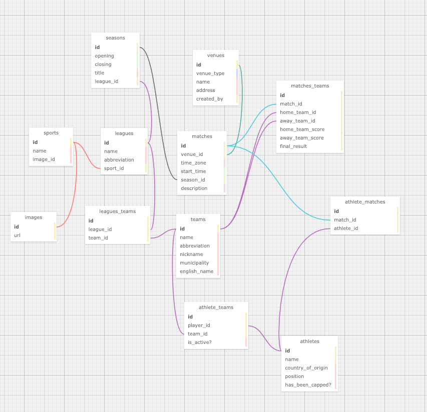

# README

This repo will be a live API following women's sports

### Setup

* Ruby version is ruby 2.6.3p62 (2019-04-16 revision 67580) [x86_64-darwin18]

* Rails 6.0.2.2 in API mode

* Database is Postgres

* Default Branch is Development

* Uses Travis CI for continuous integration

* Deploys on Heroku

### Schema

